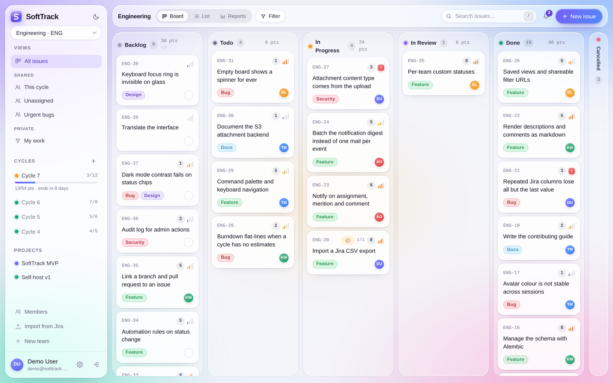
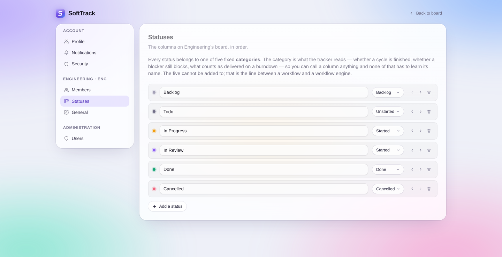
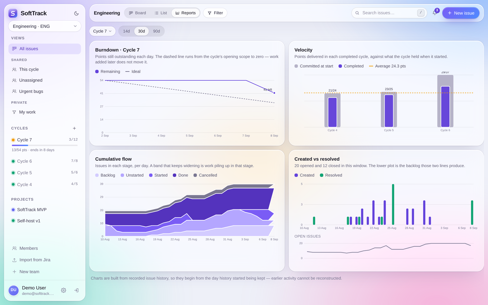
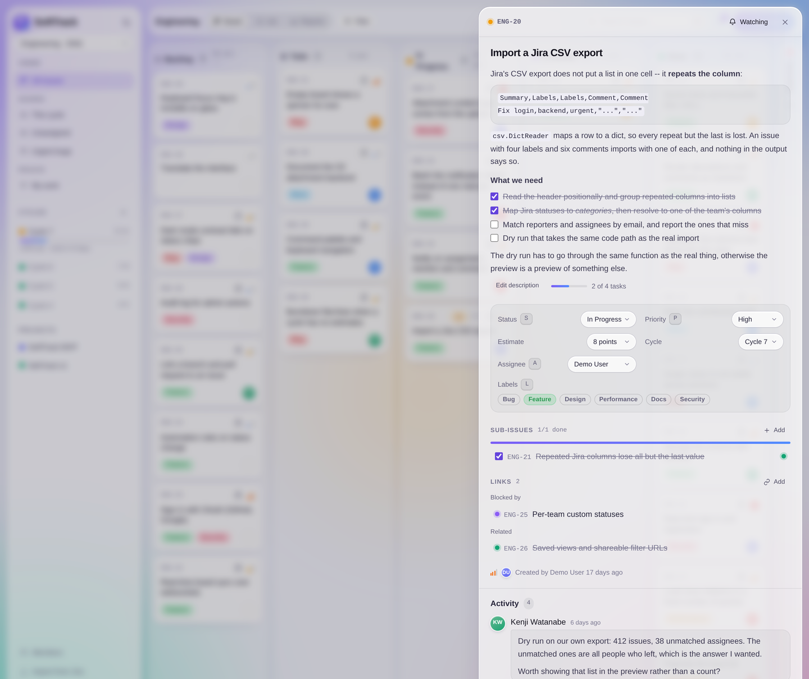
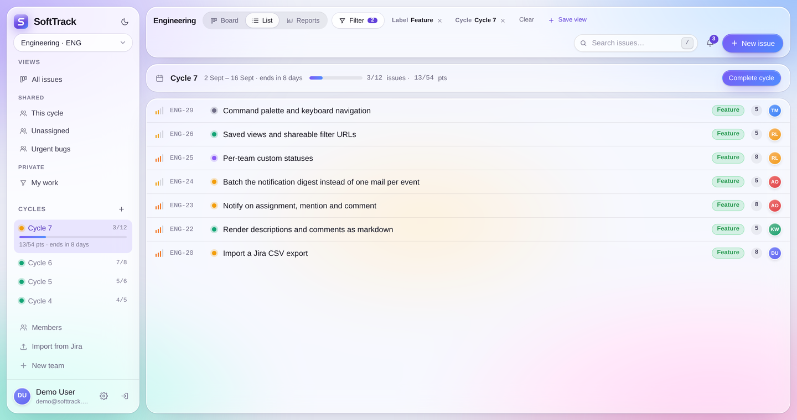
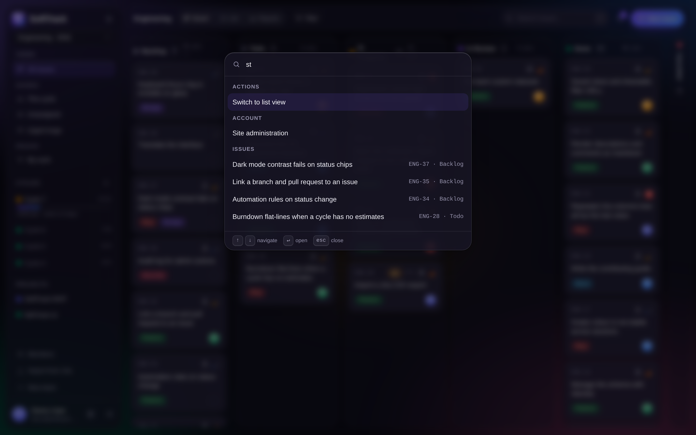
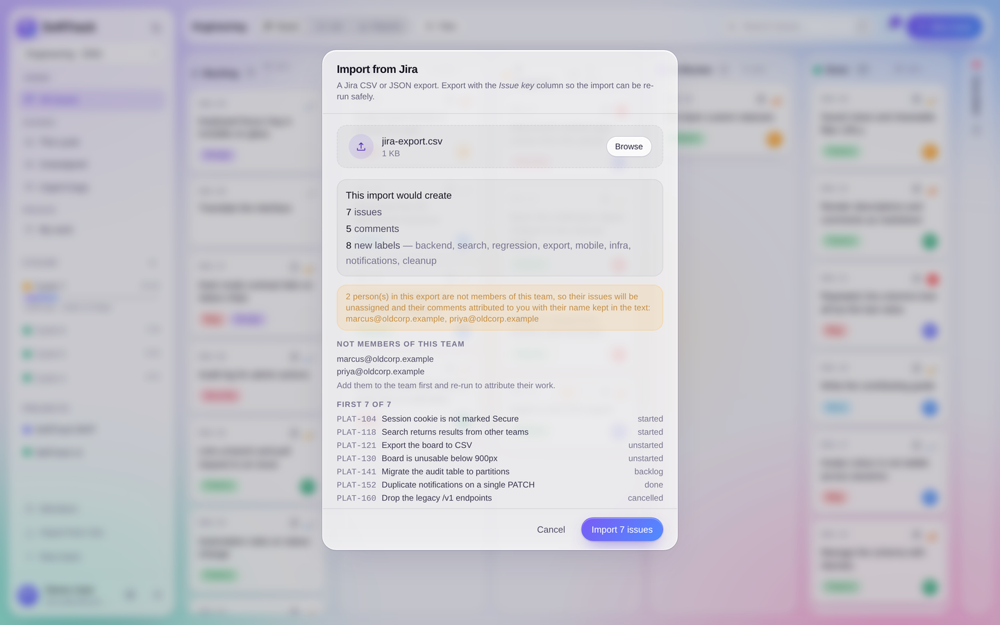

# SoftTrack

An open-source, self-hostable issue tracker inspired by Linear. Teams and
projects, a kanban board with drag-and-drop, cycles and estimates, sub-issues
and issue links, markdown with `@mentions`, reports built from real issue
history, saved views, notifications, attachments, full-text search, a command
palette, and an importer for the Jira board you are leaving behind.

FastAPI and SQLModel on the backend; React, Vite and TypeScript on the front,
with a fully typed API client generated from the backend's own OpenAPI schema.

[](https://github.com/soft-track/soft-track/actions/workflows/ci.yml)
[](LICENSE)
[](https://www.python.org/)
[](https://fastapi.tiangolo.com/)
[](https://react.dev/)
[](https://www.typescriptlang.org/)



Try it in about a minute:

```bash
git clone https://github.com/soft-track/soft-track.git
cd soft-track && docker compose up --build
```

Then open <http://localhost:5173> and sign in as `demo@softtrack.dev` /
`password123`. The seeded instance starts smaller than the screenshots in this
README, which show a team several cycles in.

## Contents

- [Features](#features) · [Roadmap](#roadmap) · [Tech stack](#tech-stack) ·
  [Project structure](#project-structure)
- Running it: [Docker](#run-with-docker) ·
  [without Docker](#quickstart-without-docker) ·
  [migrations](#database-migrations) · [the checks](#running-the-checks)
- How it works:
  [statuses](#statuses-and-categories) ·
  [cycles and estimates](#cycles-and-estimates) ·
  [reports](#reports) ·
  [sub-issues and links](#sub-issues-and-links) ·
  [markdown and mentions](#markdown-mentions-and-task-lists) ·
  [saved views](#saved-views-and-shareable-filters) ·
  [search](#search) ·
  [keyboard](#keyboard-and-the-command-palette) ·
  [automation rules](#automation-rules) ·
  [GitHub and GitLab](#github-and-gitlab) ·
  [notifications](#notifications) ·
  [attachments](#attachments) ·
  [importing from Jira](#importing-from-jira) ·
  [users and teams](#user-management) ·
  [the signed-out front door](#the-signed-out-front-door) ·
  [rate limiting](#sign-in-rate-limiting)
- [Contributing](#contributing) · [Contributors](#contributors) ·
  [License](#license)

## Features

**Issues and the board.** A kanban board whose columns are the team's own
statuses, with drag-and-drop between them, collapsible columns, and per-column
issue and point totals. A list view for the same issues when a board is the
wrong shape. Priorities, labels, assignees, projects, and comments. Issues get
identifiers from the team's key, so `ENG-42` means something in a commit
message.

**Planning.** Cycles — time-boxed iterations that carry unfinished work forward
rather than dropping it. Story-point estimates on a fixed 1/2/3/5/8 scale, with
rollups per status and per assignee computed in the database. Sub-issues one
level deep, and links between issues: blocks, relates to, duplicates.

**Reports** — burndown, velocity, cumulative flow, and created-vs-resolved —
reconstructed from a recorded history of every issue rather than from the
current state of the board.

**Finding things.** Six filters that compose (status, priority, assignee,
label, project, cycle), all of them in the URL, saveable as a named view and
shareable with the team. Full-text search across issue titles, descriptions and
comments. A command palette on `⌘K` and a keyboard path to most of the rest.

**Writing.** Markdown descriptions and comments with GitHub-flavoured tables,
task lists you can tick from the rendered view, and `@mentions` that resolve to
teammates and notify them.

**Automation.** Rules that do the repetitive bookkeeping — one trigger, any
number of conditions, and the actions to take on an issue that matches — with a
log of every change a rule made and what set it off.

**Code.** GitHub and GitLab connect by webhook, with no access token and no
clone. Branches, commits and pull requests attach to the issues their names
already mention, and can drive the rules above.

**People.** Email/password auth with revocable sessions, teams with admin and
member roles, invitations by link, an optional invite-only mode, and a site
administrator with a user directory, deactivation and password resets.

**A front door.** A landing page at `/` for signed-out visitors, which an
instance whose users all know what it is can switch off, and Open Graph tags
so a link to it unfurls with a preview rather than as a bare URL.

**Notifications.** An in-app inbox for assignments, mentions, comments and
status changes on issues you watch, plus an optional batched email digest.

**Files.** Attachments on issues and comments — paste, drag and drop, or
pick — stored on disk or in any S3-compatible bucket.

**Coming from Jira.** A CSV/JSON importer with a dry run that takes the same
code path as the real thing.

**Both themes.** Light and dark, following the system preference until you
choose otherwise.

## Roadmap

Most teams use a fraction of what Jira offers and pay for the rest in cost,
latency, and configuration sprawl. SoftTrack aims to cover that fraction well
and skip the rest deliberately.

**Next up:** sending invitations by email over SMTP, OAuth login, and a CSV
export to match the importer.

**Later:** real-time sync so two people on the same board see each other's
changes, granular permissions, SSO/SCIM, an audit log, and a capped set of
custom fields.

**Deliberately out of scope:** arbitrary workflow engines, unbounded custom
fields, a query language, a plugin marketplace, and ITSM/service-desk features.
Saying no to these is what keeps SoftTrack fast to learn and possible to
maintain.

## Tech stack

- **Backend**: FastAPI, SQLModel (SQLAlchemy + Pydantic), Alembic migrations,
  JWT auth. SQLite by default; point `DATABASE_URL` at Postgres for anything
  real — `docker compose` already does.
- **Frontend**: React 19 + Vite + TypeScript, Tailwind CSS v4 (configured
  CSS-first, in `src/index.css`), React Router, TanStack Query, `@dnd-kit` for
  drag-and-drop, `react-markdown` + `remark-gfm` for rendering, and a typed API
  client + React Query hooks generated from the backend's OpenAPI schema by
  [Orval](https://orval.dev).
- **Charts** are hand-drawn SVG rather than a charting library: four charts did
  not justify the dependency, and the tokens they use come from the same theme
  as everything else.
- **Checks**: `black` and `pytest` on the backend, `oxlint`, `tsc` and `vitest`
  on the frontend, and a job that fails if the committed OpenAPI schema drifts
  from the app.

## Project structure

```
soft-track/
├── backend/
│   ├── main.py               # FastAPI app, CORS, lifespan, router registration
│   ├── web.py                # settings, database engine, request session
│   ├── app_identity/         # routes: register, login, me, profile, site admin
│   ├── lib_identity/         # auth, usernames, admin + models/ (schemas)
│   ├── app_softtrack/        # routes: teams, projects, labels, issues, comments,
│   │                         #   attachments, cycles, reports, imports, search,
│   │                         #   notifications, views, statuses, invites,
│   │                         #   automations, integrations, webhooks
│   ├── lib_softtrack/        # one service per domain, plus:
│   │                         #   tables.py       -- every SQLModel table
│   │                         #   statuses.py     -- the five fixed categories
│   │                         #   history.py      -- what a change records
│   │                         #   storage.py      -- local or S3 attachment bytes
│   │                         #   jira.py         -- parsing an export (no database)
│   │                         #   importer.py     -- applying one to a team
│   │                         #   rules.py        -- the automation engine
│   │                         #   identifiers.py  -- finding ENG-42 in prose
│   │                         #   models/         -- request/response schemas
│   ├── lib_utils/            # password hashing, JWT, rate limiting, SMTP
│   ├── alembic/              # migrations, applied on startup
│   ├── tests/                # pytest suite (in-memory SQLite, FKs enforced)
│   ├── seed.py               # demo user/team/project/issues, idempotent
│   ├── export_openapi.py     # writes openapi.json without running a server
│   └── smoke_test.sh         # curl-based end-to-end API test
└── frontend/
    ├── orval.config.ts       # codegen config (reads ../backend/openapi.json)
    ├── src/                  # one folder per feature; `@/` aliases this dir
    │   ├── app/              # App (routes), main.tsx entry
    │   ├── api/              # axios + JWT interceptor, dates, generated/ client
    │   ├── auth/             # AuthContext, RequireAuth, login/register/invite
    │   ├── team/             # TeamContext, useTeams, useTeamData, team pages
    │   ├── board/            # BoardPage and its hooks, KanbanBoard, IssueListView,
    │   │                     #   Sidebar, TopBar, FilterBar, filters.ts
    │   ├── issues/           # IssueCard, NewIssueModal, IssueDetailPanel
    │   │   └── detail/       #   its sections + useIssueEditor
    │   ├── cycles/           # CycleList, CycleBanner, NewCycleModal
    │   ├── reports/          # the four charts and their shared geometry
    │   ├── views/            # saved views: the sidebar list and the save dialog
    │   ├── markdown/         # renderer, editor, mentions, task lists
    │   ├── attachments/      # upload hook, list, authenticated image loading
    │   ├── notifications/    # the bell, its inbox, the watch toggle
    │   ├── keyboard/         # command palette, shortcut table, global handling
    │   ├── search/           # SearchResults, useDebounced
    │   ├── imports/          # ImportJiraModal
    │   ├── automations/      # reading a rule back as the sentence it means
    │   ├── settings/         # profile, security, notifications, team roles and
    │   │                     #   invitations, statuses, automation rules,
    │   │                     #   repositories, the admin user directory
    │   └── ui/               # Avatar, Icon, Logo, Select, theme -- the genuinely
    │                         #   shared primitives
    └── index.css             # the design tokens and glass surfaces
```

## Run with Docker

The fastest way to get the whole thing running — frontend, API, and database —
with nothing installed but Docker:

```bash
docker compose up --build
```

Then open **http://localhost:5173** and sign in with `demo@softtrack.dev` /
`password123`. The API is on http://localhost:8000 (docs at `/docs`).

Three services come up in order, each waiting for the one below it to report
healthy:

| Service    | Image                | Port           | Notes                                     |
| ---------- | -------------------- | -------------- | ----------------------------------------- |
| `frontend` | nginx (multi-stage)  | 5173 → 80      | Production build, not the dev server      |
| `backend`  | python:3.13-slim     | 8000           | Migrates and seeds demo data on first start |
| `db`       | postgres:16-alpine   | internal only  | Data on the `softtrack-db` named volume   |

Useful commands:

```bash
docker compose logs -f backend    # follow API logs
docker compose down               # stop; database volume is kept
docker compose down -v            # stop and DELETE the database
```

Notes worth knowing:

- **Data persists** across `docker compose down` in the `softtrack-db` volume,
  and uploaded files in `softtrack-files`. Only `down -v` destroys them.
- **The database is not published to the host.** Only the backend can reach it.
  Uncomment the `ports` block on the `db` service to connect a local client.
- **`VITE_API_BASE_URL` is baked in at build time**, not runtime — Vite inlines
  it. It defaults to `http://localhost:8000` because your *browser* calls the
  API, not the frontend container. Serving this anywhere other than localhost
  means rebuilding with the right value:
  `docker compose build --build-arg VITE_API_BASE_URL=https://api.example.com frontend`.
- **Set a real `SECRET_KEY`** before running this anywhere but your own machine,
  and set `ENVIRONMENT` to something other than `development`. In that
  combination the app **refuses to start** while `SECRET_KEY` is still the
  default, because that default is published in this repository and anyone who
  reads it can forge a token. `SECRET_KEY=... ENVIRONMENT=production docker
  compose up` or a `.env` file next to `docker-compose.yml` both work.
- Host port 5173 is deliberate: it matches the backend's default `cors_origins`,
  so the API accepts the frontend's requests without extra configuration. If
  something else on your machine already holds 5173 (a `npm run dev` you left
  running), it will shadow the container.

## Quickstart (without Docker)

Requires Python 3.11+ and Node 20+.

### 1. Backend

```bash
cd backend
python3 -m venv venv
source venv/bin/activate          # Windows: venv\Scripts\activate
pip install -r requirements.txt
cp .env.example .env               # adjust SECRET_KEY etc. if needed

python seed.py                     # creates a demo user/team/project/issues
uvicorn main:app --reload          # http://localhost:8000
```

Demo login: `demo@softtrack.dev` / `password123`

Run `./smoke_test.sh` (with the server running) to exercise the full API
flow — register, team, project, label, issue, status patch, comment.

### 2. Frontend

In a second terminal:

```bash
cd frontend
npm install
cp .env.example .env.local         # points at http://localhost:8000 by default
npm run dev                        # http://localhost:5173
```

The generated API client under `src/api/generated/` is already checked in
and up to date with the backend as shipped, so `npm run dev` alone is enough
to get started. Sign in with the demo login above, or register a new account
(you'll be prompted to create a team on first login).

### Regenerating the API client

Any time you change backend routes, request/response schemas, or models,
regenerate the frontend client so its types stay in sync:

```bash
cd backend && source venv/bin/activate && python export_openapi.py
cd ../frontend && npm run generate:api
```

(`npm run export:openapi` does the first step for you if your backend venv
is at the default path.) CI fails if the committed `openapi.json` disagrees
with the app.

### Notes on configuration

- SQLite is the default database — fine for local use and small teams. Point
  `DATABASE_URL` in `backend/.env` at a Postgres instance for anything more
  serious. Search is one place the difference shows: see [Search](#search).
- `SECRET_KEY` in `backend/.env.example` is a placeholder — generate a real
  one (`python -c "import secrets; print(secrets.token_urlsafe(48))"`) before
  running this anywhere beyond your own machine.
- CORS origins for local dev are set in `backend/web.py`
  (`cors_origins`) — add your deployed frontend's origin there for production.
- Every other setting is commented in `backend/.env.example`, which is the
  reference for attachments and email.

---

The rest of this document is about how the parts work, and why they work that
way. None of it is needed to run SoftTrack.

## Statuses and categories

A team names its own board columns. Add "Blocked" or "QA", reorder them, rename
them, delete one — the board is a set of rows per team, not a fixed enum.



**Every status maps to one of five fixed categories**, and that is what makes
the rest safe:

| Category | Means |
| --- | --- |
| `backlog` | Not committed to yet |
| `unstarted` | Accepted, not begun |
| `started` | Work in flight, whatever the team calls the stages of it |
| `done` | Finished |
| `cancelled` | Closed without being delivered |

Nothing outside `backend/lib_softtrack/statuses.py` asks a status for its name.
Burndown, velocity, cycle completion, "3 of 5 sub-issues done", and whether a
blocker still blocks all read the *category* — so a column called "Shipped"
counts as finished everywhere without a single call site learning about it, and
one called "Blocked" is work in flight rather than a new kind of thing. The five
cannot be added to. That is the line between a workflow and a workflow engine,
and unconstrained workflow states are how Jira became Jira.

Changing the columns is a **team admin** action, unlike labels and projects
which any member creates: this is the shape of everyone's board.

**Deleting a status asks where its issues go.** It is a required choice, not a
default — issues are the point of the tracker, and guessing which column
somebody's work should land in is not a decision to make on their behalf. A
team always keeps at least one status. Saved views filtering on a deleted
status lose that one filter rather than the whole view,
[automation rules](#automation-rules) that named it follow the issues to
whichever column those went to, and no history is written for the move: the
work did not change state, the column under it was removed, and a status event
per issue would put a step in every cumulative flow diagram on the day an admin
tidied up the board.

**History records categories, not statuses.** An `issueevent` row for a status
change stores `started`, not "In Review". A chart of the past has to keep
meaning something after a team renames a column, merges two, or deletes one —
and the five categories are the only vocabulary that survives all of that. The
cost is real and worth knowing: a cumulative flow diagram shows five bands, and
cannot separate "In Progress" from "In Review", because by the time it is drawn
both are `started`. Recording status ids instead would give sharper charts that
break the first time somebody rearranges the board. It also means moving an
issue between two columns in the same category writes no history row at all,
which is correct: nothing about the work changed.

## Cycles and estimates

A cycle is a time-boxed iteration — a sprint, if that is the word your team
uses. It has a name (or just "Cycle 7"), a start, an end, and a state.

**State is set, not derived.** A cycle could infer "active" from today falling
between its dates, but then a team that forgets to start on Monday has Monday
counted against its burndown, and a cycle that runs a day long completes itself
overnight and carries work away while nobody is looking. The dates are the
plan; the state is what actually happened.

**Completing a cycle never deletes work.** Unfinished issues move to the next
upcoming cycle, or back to the backlog if there is none, and the completion
response says how many moved and where they went. A cycle boundary is an
accounting event, not a reason to lose anything. Cancelled issues count as
finished for this purpose — they are not outstanding work, and dragging them
forward for ever would be wrong.

**Estimates are story points on a fixed scale: 1, 2, 3, 5, 8.** The gaps are
the point. They stop a team arguing about whether something is a 6 or a 7, a
distinction no estimate is accurate enough to carry. Anything off the scale is
refused with a 422 that names the scale. Null means *not sized yet*, which is
deliberately distinct from an estimate of zero — and the cycle's progress
reports the unsized count alongside the totals, because a points total is only
as honest as that number is small.

Rollups per status and per assignee are computed in two grouped queries rather
than by summing the issue list in the browser. The list is paginated, so a
client-side total would quietly be "the total of whatever page happened to be
loaded" — a different and much less useful number, with nothing on screen to
say so.

## Reports



Four charts, each answering a question about the past: how many points were
outstanding on the ninth, how much did the last six cycles deliver, is work
piling up in review, is the backlog growing.

No query over the current rows can answer any of those. The `issueevent` table
is the only source — every change to an issue's status, cycle or estimate
writes a row — and each report replays those events up to the end of each day
and counts what the board looked like then. One replay serves all of them.

Three details that follow from that:

- **The burndown's ideal line runs from the cycle's *opening* scope to zero**,
  not from its current scope. Otherwise adding work mid-cycle would quietly
  move the goalposts and the line would always look on track. Scope changes are
  reported separately, as the events they are.
- **Velocity's "committed" is the scope at the moment the cycle started.** A
  team that finished everything it added late did not commit to it.
- **Charts never run into the future.** A burndown flat to the end of the
  sprint reads as "nothing is happening" rather than "this has not happened
  yet", so an active cycle's line stops today.

Reports begin from the day history started being kept. An issue with no event
at or before a given day is left out of that day entirely rather than counted
in `backlog` — that would draw work which had not been created — and the
reports page carries a line saying earlier activity cannot be reconstructed,
because a chart that quietly starts late looks like a chart of a quiet week.

## Sub-issues and links

**Sub-issues go one level deep.** A parent may not have a parent, and a child
may not have children. That pair of rules makes cycles impossible without a
graph walk — a cycle of any length needs every issue in it to have both — and
one level covers what teams actually reach for Epic/Story/Sub-task to do: break
a piece of work into pieces. A tree would need cycle detection on every write, a
recursive query to render, and an answer for what "done" means three levels up.

Progress reads "3 of 5 done" from the children's *categories*. A cancelled child
is left out of the count entirely rather than counted as done or as outstanding:
"3 of 5" should not become unreachable because two of the five were cancelled.

**Links are one row read from both ends.** `blocks`, `duplicates` and
`relates_to`, with the inverse derived at read time — storing "A blocks B" and
separately "B blocked by A" would let the two halves drift apart the first time
a delete missed one of them. Whether a card shows as *currently* blocked reads
the blocker's category, so a team's own "Shipped" column stops blocking without
anyone listing it anywhere.

## Markdown, mentions and task lists

Descriptions and comments are GitHub-flavoured markdown: headings, tables,
code, strikethrough, task lists.



**Task lists are editable from the rendered view.** Ticking a box writes back
to the markdown source at the exact offset of that `[ ]`, rather than
re-serialising the parsed document. Round-tripping markdown through a parser
normalises things the author chose on purpose — bullet characters, indentation,
hard line breaks — so the edit changes one character and leaves every other
byte where it was. The issue panel shows the resulting "2 of 4 tasks".

**`@mentions` resolve to a profile's `username`, and only to members of the
issue's team.** A handle is instance-wide; resolving one against the whole
instance would tell a stranger that a team they are not in has an issue, and
what it is called.

Handles inside code spans and fenced blocks are left alone, matching what the
renderer does with them — `curl -u @admin` in a snippet mentions nobody. The
backend blanks out code before scanning and the frontend walks text nodes
rather than the raw source; the two have to agree, because a handle the
renderer links and the backend does not resolve is a mention that looks
delivered and never arrives.

## Saved views and shareable filters

Six things narrow the board — status, priority, assignee, label, project and
cycle — and they compose. The **Filter** button in the top bar holds all of
them; whatever is active shows as a chip beside it, because a board narrowed by
a filter you cannot see is a board that looks like it has lost your issues.



**Every filter is in the URL.** `/ENG?priority=urgent&label=3` is the whole
state, so any board anyone is looking at is a link they can paste, the back
button works, and a reload lands where you were. The URL carries the *filters*
rather than a view id on purpose: a link to a private view's filters still
works for a colleague who cannot see that view, and it still lights up the
matching row in the sidebar for someone who can.

**Filtering happens on the server.** It used to run in the browser over the
page that was already loaded, which quietly meant "urgent issues among the
fifty most recent" — a different and much less useful thing, and no way to
tell from looking. This is the reason the issue list grew `label_id` and
`unassigned` parameters.

**Saving one.** With filters active, **Save view** names them. A view is
private until you share it, after which the whole team has it in their sidebar
— any member can share one, because a tracker where a useful filter needs an
admin to publish it is a tracker where people paste URLs to each other instead.
Its owner can rename, re-share or delete it; so can a team admin, so that a
shared view does not become permanent when the person who made it leaves.

**Where the board opens.** A team admin can make a shared view the team's
default, and anyone can override that for themselves from the same menu. The
precedence — your choice, else the team's, else all issues — is resolved by the
API and handed to the client as `effective_default_id`, so there is one place
that rule lives. It applies when you arrive with no filters in the URL;
clearing the filters yourself keeps them cleared.

Two things that follow from views being real rows rather than a blob of JSON:
a filter pointing at another team's label is refused when the view is saved
rather than silently matching nothing for ever, and deleting a cycle clears it
from the views that filtered on it.

## Search

`/search` covers issue titles, descriptions and comments, across every team you
belong to or one you name.

There are two implementations behind one function, chosen by the database
dialect at runtime:

- **Postgres** uses `to_tsvector` / `plainto_tsquery` ranked by `ts_rank`,
  backed by GIN indexes. That is the deployment target, and the one that stays
  fast and handles stemming — "deploying" finds "deploy".
- **SQLite** falls back to case-insensitive `LIKE`. It is the local-development
  default, it has no stemming, and it will degrade on a large dataset. Saying
  that plainly beats pretending one code path serves both equally.

Two properties hold either way. Tenancy is filtered *inside the query*, never
as a post-filter, so a bug in ranking or pagination can never widen the scope.
And a page of results costs a fixed number of queries — count, page,
comments — rather than one per result.

## Keyboard and the command palette

`⌘K` (`Ctrl+K` off a Mac) opens a palette that jumps to an issue or runs a
command; `/` focuses search, `C` creates an issue, `?` lists every shortcut,
and `Esc` closes whatever is open.



On the board, the arrow keys move between columns and cards and `Enter` opens
the focused one. On an open issue, `S`, `P`, `A` and `L` jump to status,
priority, assignee and labels — the panel prints those letters next to the
fields, so the shortcut is discoverable from the thing it acts on.

The shortcut table lives in one array in `frontend/src/keyboard/shortcuts.ts`,
which is both what the handlers dispatch on and what the cheatsheet renders. A
shortcut that works but is not listed may as well not exist; a listed one that
does not work is worse. One array makes both failures impossible.

## Automation rules

Repetitive bookkeeping — assigning, labelling, moving finished work — done by a
rule instead of by hand. A rule is one **trigger**, any number of
**conditions**, and the **actions** to take on an issue that matches. Team
admins write them under *Settings → your team → Automation*; any member can
read them, and the log.

| Trigger | Fires when |
| --- | --- |
| `issue_created` | An issue is filed |
| `status_changed` | It moves to a different column |
| `issue_assigned` | Somebody is put on it |
| `comment_added` | A comment is posted |
| `cycle_completed` | A cycle finishes, once per issue that was in it |
| `branch_created` | A branch naming it appears in a connected repository |
| `pull_request_opened` | A pull or merge request naming it opens |
| `pull_request_merged` | ...and merges. Closed-without-merging is not this |

The last three arrive from a connected repository rather than from somebody
using the tracker — see [GitHub and GitLab](#github-and-gitlab).

Conditions are status, priority, label, project and assignee (or "nobody is
assigned"). They are ANDed, and unset means "no opinion" — a rule with none of
them fires on everything its trigger reaches. Actions set the status, priority,
assignee or cycle, add a label, or post a comment; at least one is required,
because a rule that does nothing is a rule that will be read as broken.

There is deliberately no "every Monday" for rules a person triggers, no OR, no
negation and no branching. Two rules say "or" perfectly well, and each of the
others is a step towards the workflow engine SoftTrack is trying not to become.
It is the same line the five status categories draw.

**A rule's own changes never fire another rule.** The engine writes to the issue
row directly rather than going back through the update endpoint, so there is no
path from an action to a trigger — not one broken by a depth counter, one that
does not exist. Which rules match is also decided *before* any of them run, so
a rule cannot be set off by the rule above it in the list either. One thing
happening is one pass; two rules that point at each other simply take turns
being last rather than looping. Within that pass they run in the order they
were written, and the last one to set a field wins.

**Nothing is attributed to a person who did not do it.** The actor on the
history rows, the notifications and the comments an automation writes is null,
not whoever tripped the rule — which is why `comment.author_id` is nullable and
why such a comment renders as *Automation* rather than borrowing somebody's
initials. Someone dragging a card should not find their name on four changes
they did not make. The people a rule's change concerns are still told about it:
"nobody is notified about their own action" is about recognising what you just
did, and an issue that moved on its own is the opposite of that.

**Every automated change is logged, and the log outlives the rule.** The run
log records what changed, on which issue, and who did the thing that set the
rule off — and only when something actually changed, so a rule setting a status
to the one the issue was already in writes nothing. Deleting a rule keeps its
rows and nulls their link to it, because "which rule did this" is most often
asked immediately before deleting the rule that did it. The log is capped per
team and pruned as it is written; automation without a trace is a tracker that
edits itself and will not say why, and the first surprising change costs more
trust than the rules save in a year.

Two things follow from rules being real rows rather than a blob of JSON, the
same way they do for saved views. A rule naming another team's status is
refused when it is saved, not left matching nothing for ever. And when
something a rule names goes away, somebody has to decide what happens:
**deleting a status sends the rules after the issues** to whichever column
those moved to — clearing the reference would turn a condition into "no
opinion" and quietly widen the rule to every issue on the team — while
**deleting a cycle switches off the rules that filled it**, since there is
nowhere equivalent to send them and a rule left enabled would silently do less
than it says.

## GitHub and GitLab

Nothing connected an issue to the code that implements it, so the status had to
be moved by hand — twice per issue, once when the branch went up and once when
it merged.

A team admin connects a repository under *Settings → your team →
Repositories*. SoftTrack hands back a **payload URL** and a **secret** to paste
into the provider's webhook form, and that is the entire setup. After that, put
`ENG-42` in a branch name, a commit message, or a pull request's title, branch
or description, and the branch, commit or pull request appears on issue ENG-42
under **Development**.

**Reading the link out of text people already write** is the whole trick.
Nobody fills in a "related issue" field on a pull request; everybody types the
identifier into the branch name, because that is how they find the issue again.
`backend/lib_softtrack/identifiers.py` is where that scan lives, kept pure so it
can be tested on strings — it is the piece most likely to be wrong in a way
nothing notices, since a scanner that is slightly too eager links a pull request
to an issue nobody meant and a rule then moves it to Done.

It is deliberately eager, and `utf-8` is genuinely shaped like an identifier —
`UTF` is a perfectly good team key, and no pattern can tell the two apart. What
makes that harmless is that a candidate becomes a link only if a team on this
instance is actually keyed that way *and* has an issue with that number.

**Moving the issue is an automation rule, not a second settings page.** Three
triggers arrive from a connected repository — a branch appears, a pull request
opens, a pull request merges — and they go through the same engine as
everything else, so they get conditions, the same actions, and the run log for
free. A pair of settings ("which status means in review, which means shipped")
would have been a second engine for "when X happens, change the issue", and one
of them would have grown conditions eventually.

Closed-without-merging is not the merge trigger. `closed` covers both shipping
the work and giving up on it, and a rule moving the issue to Done on the second
would be wrong about the one thing it is for.

### What it does not do

SoftTrack **never clones your code, never calls the provider's API, and holds
no access token.** Everything it knows arrives in a webhook it can verify. That
is the difference between an integration you set up with a URL and a shared
secret, and one that needs an OAuth app and a `repo`-scoped token against every
repository in the org — and it is why this is a feature a self-hosted tracker
can reasonably have.

The cost is that a commit pushed while the webhook was misconfigured is not
backfilled later. There is nothing to backfill it *from*.

### Security

Two independent things have to be right for a delivery to be accepted, and
neither is enough alone: an unguessable token in the path says *which*
connection it is for, and a signature says the delivery is genuine. Knowing the
URL does not let you forge a payload; knowing the secret does not tell you
where to send one.

GitHub HMACs the request body with the secret (`X-Hub-Signature-256`), so a
payload edited in flight no longer matches. GitLab sends the secret back
verbatim (`X-Gitlab-Token`), which is weaker — a bearer secret on the wire,
depending entirely on TLS — and is what GitLab offers. Both are compared with
`hmac.compare_digest`; a `==` on a signature is a timing oracle, and what it
leaks is the ability to move somebody's issues.

**A repository is connected by one team, and text arriving from it resolves
only to that team's issues.** A commit message in one team's repository cannot
touch another team's board, however deliberately it names it. A repository two
teams both work in is connected twice, with a webhook each; the alternative is
one team's CI able to reach another team's issues.

The webhook secret is stored readable, and that is a real cost worth naming:
anyone who can read the `repository` table can forge deliveries, which means
moving issues on that team's board. It cannot be hashed — an HMAC needs the key
itself, not a digest of it — so the honest options were this or a key
management service SoftTrack does not have and would not be self-hostable
without. It is scoped to one repository on one team, and rotating it is one
button. Rotating moves the URL with the secret, so there is no half-rotated
state to reason about.

A delivery about a different repository than the connection is for is refused
even with a valid signature, because a webhook pasted onto the wrong repository
would otherwise link that project's commits to this team's issues. Failed
verifications are rate-limited per address; successful ones are not, so a busy
repository is never throttled for being busy.

### Redelivery

Webhooks are at-least-once, and both providers put a "redeliver" button in
their UI that people press while debugging exactly this. So links are upserted
on `(repository, kind, external id, issue)` and the automation triggers fire on
**transitions** — a branch row appearing, a pull request becoming merged —
rather than on a payload arriving. Press redeliver ten times and the second
through tenth change nothing, so no rule runs and no comment is posted ten
times.

A pull request SoftTrack sees for the first time *already merged* — a webhook
added after the fact — counts as the merge, not the opening. Reporting it as
"opened" would move the issue to In Review and leave it there.

### Setting it up

`API_BASE_URL` is where GitHub or GitLab reaches the API, and it is what the
payload URL on the settings page is built from. It is distinct from
`APP_BASE_URL`, which is the browser app: the provider posts to the API
directly and never loads the frontend. The default is right for a laptop and
wrong for anywhere a provider has to route to — and a webhook URL pointing at
localhost is one that silently never fires.

The Repositories page shows when each connection last received a verified
delivery, which is the one thing that tells "set up correctly" apart from "set
up and never fired".

## Notifications

Four things raise one: an issue is **assigned** to you, someone **mentions**
you with `@handle`, or an issue you are **watching** gets a comment or changes
status. They land in the inbox behind the bell in the top bar, with an unread
badge that polls once a minute.

Two rules keep the inbox worth opening, and both are enforced in
`backend/lib_softtrack/notifications.py` rather than at each call site:

- **Nothing tells you what you just did.** An inbox that reports your own
  actions back to you is one people learn to ignore.
- **One event is at most one notification per person.** A PATCH that assigns an
  issue *and* moves it to In Progress is one thing that happened, and the
  assignment is the half worth saying.

**Watching.** You start watching an issue when you create it, comment on it, or
are assigned it. The **Watch** button on any issue overrides that in either
direction, and an explicit unwatch sticks: auto-watch only ever applies where
you have expressed no preference, so muting a noisy issue survives the next
thing you do on it.

**Email is optional and off by default.** With no `SMTP_HOST` set, the inbox is
the whole feature, no digest loop runs, and **Settings → Notifications** says so
instead of offering a switch that cannot do anything. Configure a host and each
person gets one email gathering up what they have not already read:

| Setting | Default | What it does |
| --- | --- | --- |
| `SMTP_HOST` | *(blank)* | Blank disables email entirely |
| `SMTP_PORT` | `587` | |
| `SMTP_USERNAME` / `SMTP_PASSWORD` | *(blank)* | Omit for an unauthenticated relay |
| `SMTP_USE_TLS` | `true` | STARTTLS; negotiated before any credentials are sent |
| `EMAIL_FROM` | `softtrack@localhost` | |
| `APP_BASE_URL` | `http://localhost:5173` | Where the links in the mail point — also the Open Graph tags, see [the signed-out front door](#the-signed-out-front-door) |
| `DIGEST_INTERVAL_MINUTES` | `15` | How often the loop wakes up |
| `DIGEST_DELAY_MINUTES` | `10` | How long a notification waits first |

That delay is what makes it a digest rather than a mail per event: someone
triaging a dozen issues generates one email instead of twelve, and anything you
read in the app before the delay is up is never mailed at all. Anyone can turn
the mail off for themselves in **Settings → Notifications** and keep the inbox.

The loop runs in the API process, because what this project promises is
`docker compose up`. Running several replicas is still safe: each notification
is claimed with an `UPDATE ... WHERE emailed_at IS NULL RETURNING id` before
anything is sent, so only the process that wins the claim sends it. A send that
fails is logged and not retried — it is already in the recipient's inbox, and a
relay rejecting everything would otherwise have every worker re-sending the
same batch every quarter of an hour.

## Attachments

Files go on an issue or on one of its comments — paste a screenshot into the
description or the comment box, drop it in, or use **Attach**. Images render
inline; everything else becomes a download link.

**Where the bytes go.** The metadata is a database row; the file itself is
not. `ATTACHMENT_STORAGE` picks the backend:

| Setting | Where files live | Extra install |
| --- | --- | --- |
| `local` (default) | under `ATTACHMENT_DIR` | none |
| `s3` | any S3-compatible bucket — AWS, MinIO, Ceph, R2, Spaces | `pip install boto3` |

Under Docker, `ATTACHMENT_DIR` is `/data/attachments` on the `softtrack-files`
volume, so a rebuilt container keeps them. For S3, set `ATTACHMENT_S3_BUCKET`
(plus `ATTACHMENT_S3_ENDPOINT_URL` for anything that is not AWS) and leave
credentials to boto3's usual chain — they are deliberately not settings of this
app, so there is one fewer place for a key to end up in a config file. A
misconfigured store fails at startup rather than on somebody's first upload.
Adding another backend means implementing three methods; see
`backend/lib_softtrack/storage.py`.

**What is accepted.** Images (PNG/JPEG/GIF/WebP), PDFs, plain text and logs,
CSV/JSON/Markdown, patches, zips, and MP4/WebM/MOV, up to
`ATTACHMENT_MAX_BYTES` (25 MB by default). Anything else is refused with a 415
naming what would have worked.

Three things about that list are deliberate:

- **The served content type comes from the file's extension, not from the
  upload.** A stored file that is served back as `text/html` because the
  uploader said so is a stored cross-site scripting bug, so the type is looked
  up in an allowlist and everything is sent with `X-Content-Type-Options:
  nosniff` and a `default-src 'none'` CSP.
- **SVG is not accepted**, even though it is an image. An SVG is a document
  that can carry script, and the only safe way to serve one is as a download —
  which is not the inline diagram anyone wanted.
- **Images are checked against their magic bytes.** Not a security control
  — the two above are — but a `.png` that is not a PNG should fail at upload
  with a sentence rather than later as a silently broken image.

**Downloading needs the same token as everything else**, so a bare ``
cannot fetch one: the browser sends no `Authorization` header. The frontend
loads image bytes through the API client and renders them as blob URLs. Putting
a token in the URL instead would write a credential into every description that
embeds a screenshot, and into every log line that records the request.

Deleting an issue deletes its attachments, rows and bytes both. The rows go
first and the bytes after the commit: an orphaned file costs disk, while an
orphaned row costs a broken image on somebody's issue.

## Importing from Jira

**Settings → Import from Jira** takes a CSV or JSON export and lands its issues,
comments, labels and projects in a team.



**The dry run and the real run take the same path.** The only difference is
that the dry run rolls back at the end. A preview produced by a different code
path is a preview of something else, and the whole point is to be able to trust
what it says: the counts, the new labels it would create, and the people it
could not match are the ones you will get.

Three pieces of real Jira knowledge are in there, and each is a way naive
importers go wrong:

- **Jira repeats columns instead of putting a list in one cell.** A row can
  carry `Labels,Labels,Labels` and `Comment,Comment`. `csv.DictReader` maps a
  row to a dict, so every repeat but the last is lost — an issue with four
  labels and six comments imports with one of each, silently. The parser reads
  the header positionally and groups repeats into lists.
- **Statuses map to categories, then to one of the team's columns.** The parser
  has no team in front of it, so it can only say what a Jira status *means*.
  The importer then prefers a column the team already calls the same thing
  before falling back to the category — so "In Review" lands in a team's own
  "In Review" rather than merging into whatever else is `started`.
- **People are matched by email**, and everyone who did not match is listed in
  the report rather than counted. A count tells you something is wrong; the
  addresses tell you what to do about it. Their issues arrive unassigned and
  their comments are attributed to you with the original name kept in the text.

Export with the **Issue key** column and the import is re-runnable: keys
already imported are left alone rather than duplicated.

## User management

### The first account is the site administrator

Whoever registers first on a fresh instance gets `is_site_admin`. There is
nobody to grant it otherwise, and an instance with no administrator has no way
to ever get one. Upgrading an existing install promotes the oldest account for
the same reason. From **Settings → Administration → Users** a site admin can
search the directory, deactivate and reactivate accounts, hand the privilege to
somebody else, and set a password for a colleague who is locked out.

Two guards you will meet rather than read about: nobody can deactivate or
demote *themselves*, and the last active site administrator cannot be switched
off by anyone. Both exist because the failure is unrecoverable without database
access.

### Team roles

Every membership is `admin` or `member`. Admins rename the team, invite people,
change roles, edit the statuses, and remove members; members do everything else.
Anyone can leave a team on their own. A team always keeps at least one **active**
admin — "active" matters, because a team whose other admin was deactivated
months ago would otherwise be one departure away from having nobody who can add
anyone.

A team's **key** cannot be changed. `ENG-42` is already in commit messages,
chat logs and browser history by the time anyone wants to rename it.

### Invitations, without a mail server

SoftTrack does not send invitations by email — the only mail it sends is the
[notification digest](#notifications), and that is off unless SMTP is
configured. An invitation is a row and a link: a team admin
invites an address from **Settings → *Team* → Members**, and copies the link
into whatever the team already uses. That works whether or not the person has
an account — `/invite/<token>` shows who invited them, to which team, and as
what, and offers to sign in or register from there.

- One live invitation per address per team. Re-inviting the same address mints
  a fresh token and retires the old link, which is what "resend" does.
- Accepting checks the signed-in user's address against the invitation's, so a
  forwarded link admits nobody it was not sent to.
- Accept, decline and revoke all delete the row. The membership and its
  `joined_at` are the record worth keeping.
- Links expire after `INVITE_EXPIRE_DAYS` (7 by default).

### Invite-only instances

Set `OPEN_REGISTRATION=false` and `/auth/register` only accepts a registration
whose email already has a live invitation waiting. The sign-up page says so
rather than failing on submit. The first-account rule is unchanged, so bring an
instance up, register yourself, then close it.

### The signed-out front door

`/` shows a landing page to a visitor who is not signed in: what the tracker
is, what is in it, and a way in. Signed in, `/` is your board exactly as
before. Deep links are unaffected — open `/ENG/issue/42` signed out and you
are asked to sign in, then taken to the issue.

| Setting | Default | What it does |
| --- | --- | --- |
| `LANDING_PAGE` | `true` | `false` sends `/` straight to `/login` |

Most instances belong to one company, sit behind a VPN, and are opened by
people who already know what the tool is. A marketing page in front of the
sign-in form is friction there — an extra click every morning, for everyone —
so `LANDING_PAGE=false` restores the old behaviour exactly. The default is on
for the same reason `OPEN_REGISTRATION` defaults open: the instance nobody has
configured yet is the one most likely to be opened by a stranger.

The sign-up call to action follows `OPEN_REGISTRATION`, so an invite-only
instance never links to a form that will refuse.

**The demo credentials are not shown on your instance.** The sign-in page
prefills `demo@softtrack.dev` and prints its password only where `ENVIRONMENT`
is `development` or `demo` — the two that `seed.py` actually seeds with that
account. Anywhere else the field starts empty, so a password manager can fill
it, and nothing is advertised. That is deliberate: it is a working password,
and it belongs on the public demo only.

**Links unfurl.** `index.html` carries a description, Open Graph and Twitter
card tags, and a preview image, so an instance pasted into Slack shows the
board rather than a bare URL. The absolute URLs in those tags come from
`APP_BASE_URL`, which the frontend takes as a build argument — `docker
compose` passes the same value to both halves. One limit worth knowing: this
is a client-rendered app, so unfurlers that read the static HTML get the tags,
while a crawler that does not run scripts still finds an empty shell.

### Deactivate, not delete

Accounts are never deleted. Issues, comments and history all carry foreign keys
to users, so removing the row would either take that work with it or leave the
tracker unable to say who did what. Deactivating an account signs it out
immediately, refuses its next sign-in, and keeps it out of assignee pickers —
while its issues stay assigned and its comments stay attributed. Reactivating
undoes all of it.

"Immediately" is worth a sentence, because tokens live for a week. Every user
row carries a `token_version` that is copied into their JWTs and checked on
each request; deactivating, changing a password, resetting one, or using
**Sign out everywhere** bumps it, and every token issued before that stops
working. Tokens minted before this feature carry no version and are read as
`0`, which matches every existing row — so upgrading signs nobody out.

## Sign-in rate limiting

`/auth/login` and `/auth/register` are throttled, so credential guessing costs
an attacker time. The budgets live in `backend/lib_utils/rate_limit.py`:

| Bucket | Free attempts | Backoff | Cap |
|---|---|---|---|
| Failed sign-ins per address | 10 | doubles from 1s | 15 min |
| Failed sign-ins per account | 5 | doubles from 1s | 1 min |
| Registrations per address | 10 | doubles from 15s | 1 hour |

A successful sign-in clears the counters, and any key that goes quiet for the
forget window is dropped entirely, so a bad afternoon never follows you into
the next day. Refusals return **429** with a `Retry-After` header.

The per-account cap is deliberately the short one. A per-account lockout is
itself an attack — without a cap, anyone who knows your address could keep you
out of your own account — so it is set to slow a password spray to roughly one
guess a minute rather than to lock anybody out.

Two things worth knowing before you deploy:

- **The counters are per process.** They live in memory, which covers the
  single-worker container this repo ships. Run several workers or replicas and
  each keeps its own counters, so the real budget is multiplied by the process
  count. `Throttle` is the one class to reimplement against a shared cache if
  you outgrow that.
- **Behind a proxy, everyone shares one bucket.** The limiter uses the address
  the server actually sees, and deliberately ignores `X-Forwarded-For`, since
  any client can set that header and mint a fresh identity per request. If you
  terminate TLS at nginx or a load balancer, run uvicorn with
  `--proxy-headers --forwarded-allow-ips=<your proxy's address>`; Starlette
  will then rewrite the client address from the header it can trust.

## Database migrations

The schema is managed by **Alembic**. The URL comes from `DATABASE_URL`, the same
setting the app uses, so nothing is duplicated in `alembic.ini`.

You do not normally run anything: the app applies migrations on startup, so
`docker compose up` is enough, and **upgrading an existing install adopts its
database rather than rebuilding it** — a database created before Alembic gets
stamped at the baseline automatically, keeping its data.

To change the schema:

```bash
cd backend
alembic revision --autogenerate -m "add x to y"   # then READ the generated file
alembic upgrade head
```

Autogenerate is reliable for added tables, columns and indexes, and unreliable
for server defaults, constraint renames, and anything touching data — review
what it writes before committing it. Migrations run with `render_as_batch` on
SQLite, which cannot `ALTER` most things in place.

CI fails a pull request that leaves **two Alembic heads**. Two branches that
each add a migration from the same parent produce them, nothing breaks until a
deploy runs `upgrade head`, and the app refusing to boot is a bad place to find
out.

## Running the checks

CI runs four jobs on every pull request, and all four run locally.

**Backend** — formatting, a single migration head, and the test suite behind a
coverage floor:

```bash
cd backend && pip install -r requirements-dev.txt
black --check . --exclude venv
alembic heads                                  # exactly one, or CI fails
pytest --cov --cov-fail-under=85
```

**Frontend** — lint, typecheck, unit tests, build:

```bash
cd frontend && npm ci
npm run lint && npx tsc -b --noEmit && npm test && npm run build
```

**API contract** — regenerates `backend/openapi.json` and fails if it differs
from the committed copy. That file is what the typed frontend client is
generated from, so drift means the client and the API disagree — confusingly,
at runtime, instead of loudly at build time.

**Docker** — builds both images, brings the stack up against real Postgres, and
runs `backend/smoke_test.sh` over HTTP. The unit suite runs in-process against
SQLite; this is the only place a response-shape change shows up before a user
finds it.

Tests use in-memory SQLite with `PRAGMA foreign_keys=ON`, so they enforce
referential integrity the way the Postgres deployment does rather than the way
SQLite does by default. `backend/tests/conftest.py` explains which bug got
through when they did not.

## Contributing

Issues and pull requests are welcome, and there are
[good first issues](https://github.com/soft-track/soft-track/labels/good%20first%20issue)
open. **[CONTRIBUTING.md](CONTRIBUTING.md)** covers setup, the checks CI runs,
and the three project conventions worth knowing before you open a PR: the API
client is generated *and committed*, business logic belongs in `lib_softtrack/`
rather than in a route handler, and schema changes need an Alembic migration.

Everyone taking part is asked to follow the
[Code of Conduct](CODE_OF_CONDUCT.md). Security problems should go through
[private reporting](https://github.com/soft-track/soft-track/security/advisories/new),
not a public issue.

## Contributors

SoftTrack is built by the people below. The list comes from the repository's
own history — `git shortlog -sne` — so a merged pull request is all it takes to
join it.

<table>
  <tr>
    <td align="center" width="150">
      <a href="https://github.com/Kholakhalid012">
        <br>
        <sub><b>Khola Khalid</b></sub>
      </a><br>
      <sub>Created the project</sub>
    </td>
    <td align="center" width="150">
      <a href="https://github.com/wak327">
        <br>
        <sub><b>Waleed Khalid</b></sub>
      </a><br>
      <sub>Maintainer</sub>
    </td>
    <td align="center" width="150">
      <a href="https://github.com/jabrailkhalil">
        <br>
        <sub><b>Jabrail</b></sub>
      </a><br>
      <sub>Contributor</sub>
    </td>
  </tr>
</table>

## License

MIT — see [LICENSE](LICENSE).
